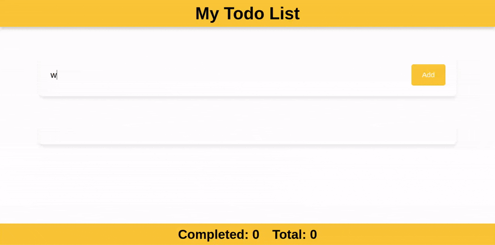

# to-do-app

To-do application built following the  [React Playlist](https://youtu.be/MHn66JJH5zs?si=EvqL1e-8hv8Swi97) from the Code Stoic channel on YouTube.

## Technologies
React
Vite (project builder)
TypeScript

## Knowlege applied
- Components
- Passing props through components
- How to use a state and the useState hook
- How to use CSS modules for style components